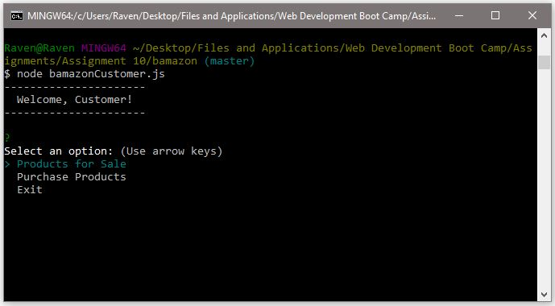
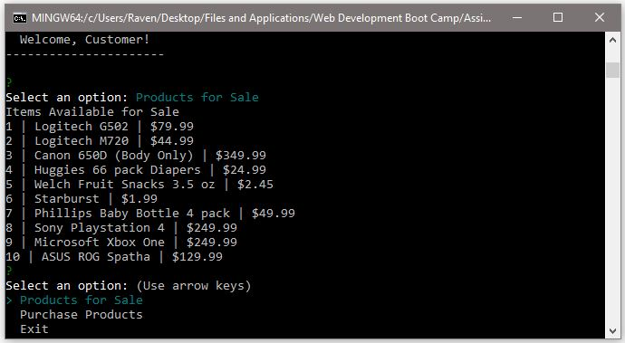
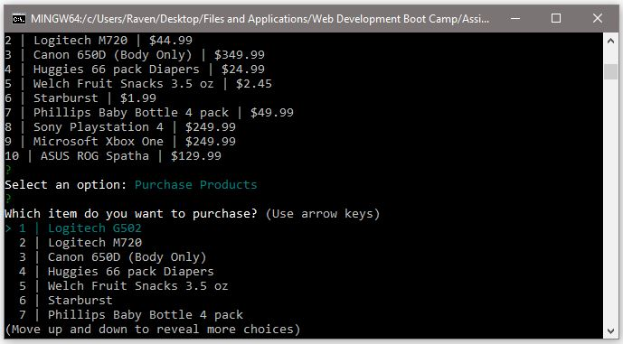
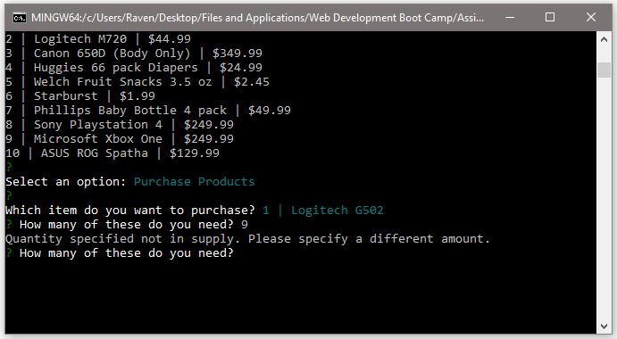
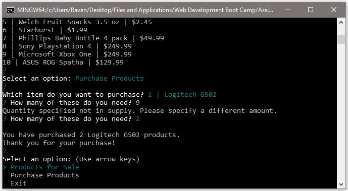
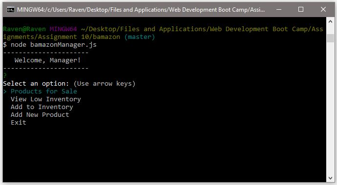
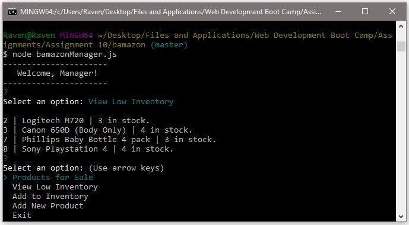
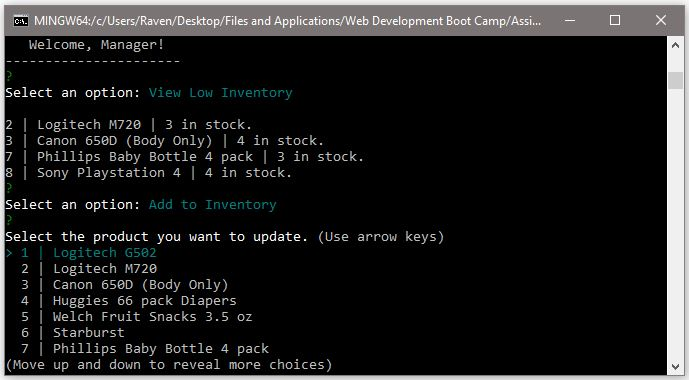

# Bamazon
Assignment 10 Node.js &amp; MySQL

This program includes a MySQL database for customers and managers to interact with. Customers may view the products and choose the products they want to purchase. Managers have a few more options, where they can view the products for sale, update invintory, and so on. Let's take a look at how a customer interacts with the application.

# Customer User Interface
Upon running the application, the customer is greeted with three options. They can view the products for sale, make a purchase, or simply exit the program.

When the customer selects "Products for Sale", the application displays all of the items from the database to the user. This data includes the products item ID, product name, and price.

The customer can now choose to purchase a products or exit the application. When they select "Purchase Products", the application brings up a list of the products for sale. The customer can then scroll through what they want to purchase.

Once the product has been selected, the customer can then enter the amount they want. If they enter a number below 0 or if the stock quantity is not enough, the application will alert the customer and prevent any changes to the database. The customer must enter a valid input to continue.

When the customer has purchased the product, the application will confirm their purchase by displaying the quantity and product that was chosen by the customer. The customer can now purchase more items or exit the application.

# Manager User Interface
Like the customer, the manager is greeted with a few choices upon start up. There are a few more options compared to the customers' view.

We will skip over "Products for Sale" as we've already covered it in the customer view. The manager can view the products that have stock quantities less than 5. They can do this by selecting the "View Low Inventory" selection. This will send a query to the database to display only the products with less than 5 units in stock.

The manager can also add inventory for the existing products in the database. This will bring up a list of all of the products in the database.

Once the product of choice has been chosen, the application will prompt the manager for more information.